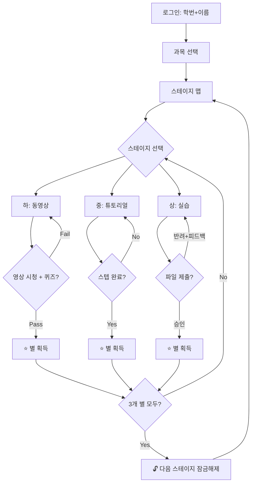

# 🌟 StarQuest - 특성화고 개별화 수업 플랫폼

> **"별을 모으며 성장하는 나만의 학습 여정"**

---

## 📋 프로젝트 개요

| 항목 | 내용 |
|------|------|
| **프로젝트명** | StarQuest (스타퀘스트) |
| **대상** | 특성화고등학교 학생 (건축 관련 과목) |
| **목적** | 게이미피케이션을 통한 자기주도 학습 촉진 |
| **기술스택** | React + Vite + Zustand + localStorage(MVP) |
| **핵심 컨셉** | 별 수집 기반 단계별 진행 시스템 |
| **기본 과목** | 건축 도면 해석과 제도 / 건축캐드 |
| **테마** | 건축(Building & Blueprint) |

---

## 🎯 기획팀 기획서

### 1. 핵심 아이디어

학생들이 **게임을 플레이하듯** 학습을 진행합니다. 각 단원(스테이지)은 **하/중/상** 3개의 난이도로 구성되며, 모든 난이도를 클리어해야 다음 스테이지로 넘어갑니다.

```
🗺️ 학습 로드맵 (스테이지 맵)
━━━━━━━━━━━━━━━━━━━━━━━━━━━━━━━━━━━━
  [Stage 1] ──→ [Stage 2] ──→ [Stage 3] ──→ ...
     ⭐⭐⭐        🔒            🔒
     
  각 스테이지 내부:
  ┌─────────────────────────────────┐
  │  ⭐ 하(Easy)    - 동영상       │ → 별 1개
  │  ⭐ 중(Normal)  - 튜토리얼     │ → 별 1개  
  │  ⭐ 상(Hard)    - 실습/제출    │ → 별 1개
  └─────────────────────────────────┘
  → 3개 별 모두 획득 시 다음 스테이지 잠금해제
```

### 2. 난이도별 학습 방식

#### ⭐ 하 (Easy) - 동영상 학습
- **형태**: 학습 영상 시청 + 간단한 확인 퀴즈
- **내용**: 교사가 제작한 동영상을 보고 핵심 개념 학습
- **완료 조건**: 영상 100% 시청 + 확인 퀴즈 통과 (3문제 중 2문제 이상)
- **예시**: "건축 도면의 기본 기호 이해하기" 영상 시청 후 퀴즈

#### ⭐⭐ 중 (Normal) - 튜토리얼 따라하기
- **형태**: 스텝 바이 스텝 가이드 (인터랙티브 튜토리얼)
- **내용**: 화면에 표시되는 지시사항을 순서대로 따라하기
- **완료 조건**: 모든 스텝 완료 시 자동으로 별 획득
- **예시**: "CAD에서 벽체 그리기: 1단계 → 2단계 → ..."

#### ⭐⭐⭐ 상 (Hard) - 실습 과제 수행
- **형태**: 직접 프로그램 실행 → 과제 수행 → 파일 제출
- **내용**: 주어진 미션에 따라 실제 프로그램으로 결과물 생성
- **완료 조건**: 결과 파일 업로드 + 교사 확인 (자동/수동)
- **예시**: "주어진 평면도를 보고 CAD로 벽체와 창호를 작도하여 제출"

### 3. 과목 & 커리큘럼

교사가 관리자 페이지에서 **새로운 과목, 스테이지, 테마를 자유롭게 추가** 가능합니다.

- 과목 추가 시 **커스텀 테마**(대표 색상, 아이콘, 배경 스타일) 설정 가능
- 기본 제공: 건축 블루프린트 테마 / 추가 예시: 전기·전자, 기계, 디자인 등

#### 기본 제공 과목 (샘플 데이터)

**📐 건축 도면 해석과 제도**
| 스테이지 | 단원명 | 하(동영상) | 중(튜토리얼) | 상(실습) |
|----------|--------|-----------|-------------|---------|
| 1 | 건축 도면의 기본 | 기본 기호와 표기법 | 제도 용구 사용법 | 기본 도면 기호 그리기 |
| 2 | 평면도 이해 | 평면도 읽는 법 | 간단한 방 평면 | 원룸 평면도 작도 |
| 3 | 입면도와 단면도 | 입/단면도 원리 | 입면도 분석 | 입면도 작도 |

**🖥️ 건축캐드**
| 스테이지 | 단원명 | 하(동영상) | 중(튜토리얼) | 상(실습) |
|----------|--------|-----------|-------------|---------|
| 1 | CAD 기초 | 인터페이스 소개 | 기본 명령어 | 선/원 그리기 과제 |
| 2 | 벽체 작도 | 벽체 그리기 원리 | 벽체 그리기 따라하기 | 벽체 도면 제출 |
| 3 | 창호 배치 | 창호 기호와 규격 | 창호 삽입 따라하기 | 창호 배치 과제 |

### 4. 게이미피케이션 요소

| 요소 | 설명 |
|------|------|
| **⭐ 별 수집** | 각 난이도 완료 시 별 1개 (스테이지당 최대 3개) |
| **🔓 스테이지 잠금해제** | 이전 스테이지 3개 별 모두 획득 시 다음 스테이지 오픈 |
| **🏆 뱃지 시스템** | 특정 조건 달성 시 뱃지 획득 (예: 첫 클리어, 연속 학습 등) |
| **📊 진도 현황** | 전체 학습 진행률 시각화 (프로그레스 바, 별 맵) |
| **🔥 연속 학습** | 연속 학습 일수 표시로 동기부여 |

### 5. 사용자 역할 & 인증

#### 👨‍🎓 학생
- **로그인**: 학생번호 + 이름으로 인증
- 스테이지 맵에서 현재 진행 상황 확인
- 난이도별 미션 수행 및 별 수집
- 파일 업로드 (상 난이도)
- 자신의 진도/별/뱃지 확인

#### 👩‍🏫 교사 (관리자) - LXP 시스템
교사는 **학습 경험 플랫폼(LXP)** 기능을 통해 수업의 전 과정을 관리합니다.

| LXP 기능 | 설명 |
|-----------|------|
| **📋 계획(Plan)** | 과목/스테이지/미션 생성·편집, 커리큘럼 설계, **과목별 테마(색상·아이콘·배경) 설정** |
| **📊 모니터링(Monitor)** | 학생별/반별 진도 현황 대시보드, 실시간 학습 추적 |
| **✅ 평가(Assess)** | 제출물 검토 및 채점, 퀴즈 결과 확인, 합격/반려 결정 |
| **💬 피드백(Feedback)** | 학생별 코멘트 작성, 과제 반려 시 피드백 메시지 |

### 6. 주요 화면 구성

```
[학생 화면]
1. 🔐 로그인 페이지
   - 학생번호 + 이름 입력
   - 과목 선택

2. 🗺️ 스테이지 맵 (메인)
   - 건축 블루프린트 스타일 배경
   - 스크롤 형태의 스테이지 목록
   - 각 스테이지의 별 획득 상태 표시

3. 📖 스테이지 상세
   - 하/중/상 3개 카드 → 건축 도면 카드 스타일
   - 각 카드에 완료 여부(별) 표시

4. 🎬 하 - 동영상 뷰
   - 임베드 비디오 플레이어
   - 시청 완료 감지 + 확인 퀴즈

5. ⭐ 중 - 튜토리얼 뷰
   - 스텝 네비게이션 (이전/다음)
   - 이미지 + 텍스트 가이드

6. 🚀 상 - 실습 과제 뷰
   - 과제 설명 (미션 브리핑)
   - 파일 업로드 + 제출 상태 표시

7. 👤 프로필 & 진도
   - 총 별 / 뱃지 / 과목별 진행률

[관리자(LXP) 화면]
8. 📋 대시보드 (Overview)
   - 전체 학생 진도 요약
   - 미검토 제출물 알림

9. � 과목/스테이지 관리 (Plan)
   - 과목 CRUD
   - 스테이지/미션 편집기
   - 동영상 URL, 튜토리얼 스텝, 과제 설명 입력

10. ✅ 제출물 평가 (Assess)
    - 학생 제출물 목록 + 파일 다운로드
    - 합격/반려 결정

11. 💬 피드백 (Feedback)
    - 학생별 코멘트 작성
    - 반려 시 개선점 안내
```

### 7. 학습 흐름 (User Journey)



---

## 🎨 디자인팀 기획서

### 1. 디자인 컨셉

- **테마**: 건축 블루프린트 (Building & Blueprint)
- **톤앤매너**: 전문적이면서 깨끗한 + 청사진 느낌
- **메인 컬러**:
  - Primary: `#1A365D` (진한 네이비, 청사진 배경)
  - Secondary: `#F6AD55` (주황/금색, 별/하이라이트)
  - Accent: `#38B2AC` (틸, 진행/성공)
  - Blueprint: `#2B6CB0` (블루프린트 청색)
  - Grid Line: `#4A90D9` (격자선)
  - BG Light: `#F7FAFC` (밝은 배경)
  - Text: `#E2E8F0` (다크 모드 텍스트)

### 2. 비주얼 스타일

- **스테이지 맵**: 청사진/설계도 배경 위에 건물 아이콘으로 배치된 스테이지 노드
- **별**: 금색 건축 측량 별 스타일
- **잠금 스테이지**: 회색 건물 실루엣 + 자물쇠
- **해금 스테이지**: 완공된 건물 아이콘 + 글로우
- **난이도 카드**: 도면 용지 스타일 카드
  - 하: 🟢 초록 (안전/쉬움)
  - 중: 🟡 노랑 (주의/보통)  
  - 상: 🔴 빨강 (도전/어려움)
- **배경 패턴**: 설계도면 격자(그리드) 패턴

### 3. UI/UX 원칙

1. **직관적 내비게이션**: 학생이 현재 위치와 다음 할 일을 즉시 파악
2. **즉각적 피드백**: 별 획득 시 건물 완공 애니메이션
3. **진행감 시각화**: 건물이 점점 올라가는 프로그레스 표현
4. **반응형**: 데스크톱(교실 PC) + 태블릿 대응
5. **청사진 다크모드**: 기본 다크 블루 배경 (설계도 느낌)

### 4. 핵심 컴포넌트

```
📦 Components
├── 🗺️ StageMap          - 스테이지 맵 (블루프린트 배경)
│   ├── StageNode        - 개별 스테이지 (건물 아이콘)
│   └── StagePath        - 스테이지 간 연결 (설계선)
├── 📖 StageDetail       - 스테이지 상세 (3개 난이도 카드)
│   ├── DifficultyCard   - 난이도 카드 (도면 용지 스타일)
│   └── StarIndicator    - 별 획득 표시기
├── ⭐ Missions
│   ├── VideoView        - 동영상 + 퀴즈 (하)
│   ├── TutorialView     - 튜토리얼 스텝 (중)
│   └── PracticeView     - 실습 과제 + 업로드 (상)
├── 🎮 Gamification
│   ├── StarBadge        - 별 컴포넌트
│   ├── ProgressBar      - 진행률 바
│   └── CelebrationModal - 축하 모달
├── 🔐 Auth
│   └── LoginForm        - 학번+이름 입력
├── 👤 Profile
│   └── UserStats        - 사용자 통계/진도
└── 🛠️ Admin (LXP)
    ├── AdminDashboard   - 대시보드 (Overview)
    ├── CourseManager    - 과목/스테이지 관리 (Plan)
    ├── SubmissionReview - 제출물 평가 (Assess)
    └── FeedbackPanel   - 피드백 관리 (Feedback)
```

---

## ⚙️ 기술팀 설계서

### 1. 기술 스택

| 분류 | 기술 | 이유 |
|------|------|------|
| **프레임워크** | React 19 | 컴포넌트 기반, 생태계 |
| **번들러** | Vite 6 | 빠른 HMR, ESM 기반 |
| **라우팅** | React Router v7 | SPA 라우팅 |
| **상태관리** | Zustand | 경량, 간단한 API |
| **스타일** | CSS Modules + CSS Variables | 스코프 격리, 건축 테마 |
| **아이콘** | Lucide React | 경량 아이콘 세트 |
| **저장소** | localStorage (MVP) | 서버 없이 빠른 프로토타입 |
| **파일 업로드** | File API + IndexedDB | 클라이언트 사이드 저장 |

### 2. 프로젝트 구조

```
d:\personal/
├── public/
│   └── favicon.svg
├── src/
│   ├── assets/              # 이미지, 폰트
│   ├── components/
│   │   ├── common/          # Button, Modal, ProgressBar
│   │   ├── auth/            # LoginForm
│   │   ├── stage/           # StageMap, StageNode, StageDetail
│   │   ├── mission/         # VideoView, TutorialView, PracticeView
│   │   ├── gamification/    # StarBadge, CelebrationModal
│   │   └── admin/           # LXP 관리자 컴포넌트
│   ├── pages/
│   │   ├── LoginPage.jsx
│   │   ├── StageMapPage.jsx
│   │   ├── StagePage.jsx
│   │   ├── MissionPage.jsx
│   │   ├── ProfilePage.jsx
│   │   └── admin/
│   │       ├── AdminDashboardPage.jsx
│   │       ├── CourseManagerPage.jsx
│   │       ├── SubmissionPage.jsx
│   │       └── FeedbackPage.jsx
│   ├── stores/
│   │   ├── useAuthStore.js      # 인증 (학번+이름)
│   │   ├── useStageStore.js     # 스테이지/미션 데이터
│   │   ├── useProgressStore.js  # 학생 진행상황
│   │   └── useAdminStore.js     # 관리자 데이터
│   ├── data/
│   │   └── sampleCourses.js     # 건축 도면/캐드 샘플
│   ├── styles/
│   │   ├── variables.css
│   │   ├── global.css
│   │   └── animations.css
│   ├── App.jsx
│   └── main.jsx
├── index.html
├── vite.config.js
└── package.json
```

### 3. 데이터 모델

```javascript
// Course (과목) - 교사가 새로 추가 가능
{
  id: "course-1",
  title: "건축 도면 해석과 제도",
  description: "건축 도면의 기본부터 작도까지",
  icon: "📐",
  theme: {
    primaryColor: "#1A365D",
    accentColor: "#F6AD55",
    bgPattern: "blueprint"   // blueprint | circuit | mechanical | minimal
  },
  stages: ["stage-1", "stage-2", "stage-3"]
}

// Stage (스테이지/단원)
{
  id: "stage-1",
  courseId: "course-1",
  title: "건축 도면의 기본",
  order: 1,
  missions: {
    easy:   { type: "video",    /* ... */ },
    normal: { type: "tutorial", /* ... */ },
    hard:   { type: "practice", /* ... */ }
  }
}

// Mission (미션)
{
  id: "mission-1-easy",
  type: "video" | "tutorial" | "practice",
  title: "기본 기호와 표기법",
  // type=video (하)
  videoUrl: "...", quizQuestions: [...],
  // type=tutorial (중)
  tutorialSteps: [...],
  // type=practice (상)
  taskDescription: "...", requiredFileTypes: [".dwg", ".pdf"]
}

// Student (학생)
{
  studentId: "20101",       // 학번
  name: "김학생",
  role: "student",
  courses: ["course-1"],
  totalStars: 6,
  progress: {
    "course-1": {
      "stage-1": { easy: true, normal: true, hard: true },
      "stage-2": { easy: true, normal: false, hard: false }
    }
  },
  submissions: [{ stageId, file, status, feedback }]
}

// Admin (교사)
{
  adminId: "teacher-1",
  name: "박선생",
  role: "admin",
  password: "..." // 간단 비밀번호
}
```

### 4. LXP 관리자 기능 상세

```
📋 Plan (계획)
├── 과목 추가/수정/삭제
├── 스테이지 추가/수정/삭제/순서변경
├── 미션 콘텐츠 편집
│   ├── 동영상 URL + 퀴즈 문항 입력
│   ├── 튜토리얼 스텝 작성 (이미지+텍스트)
│   └── 실습 과제 설명 + 제출 파일 형식 지정
└── 학생 계정 관리 (학번 목록 등록)

📊 Monitor (모니터링)
├── 학생별 진도 현황 테이블
├── 스테이지별 완료율 차트
└── 최근 활동 로그

✅ Assess (평가)
├── 미검토 제출물 목록
├── 제출 파일 미리보기/다운로드
├── 합격 / 반려 결정
└── 퀴즈 결과 조회

💬 Feedback (피드백)
├── 학생별 코멘트 작성
├── 반려 시 개선점 메시지
└── 학습 권장사항 안내
```

### 5. MVP 범위 (P0)

| 기능 | 포함 |
|------|------|
| 학생 로그인 (학번+이름) | ✅ |
| 과목 선택 | ✅ |
| 스테이지 맵 & 내비게이션 | ✅ |
| 하(동영상+퀴즈) 미션 뷰 | ✅ |
| 중(튜토리얼) 미션 뷰 | ✅ |
| 상(과제+파일 업로드) 미션 뷰 | ✅ |
| 별 수집 & 스테이지 잠금해제 | ✅ |
| 프로필 & 진도 현황 | ✅ |
| 관리자 LXP (Plan/Monitor/Assess/Feedback) | ✅ |
| 축하 애니메이션 | ✅ |
| 건축 블루프린트 테마 | ✅ |
